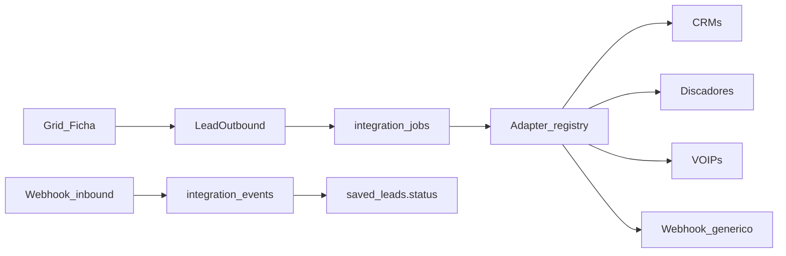

# Integrações outbound — discadores, VOIPs e CRMs

O GRID gera e qualifica a lista de cold call. CRM, discador e VOIP **executam** a ligação. Esta camada é Fase 4: outbound-first, com um canal estreito de eventos inbound (tabulação). Não há sync bidirecional de CRM.

Código de referência:

- Contrato: [`src/lib/integrations/schema.ts`](../src/lib/integrations/schema.ts)
- Mapper `LeadDossier` → `LeadOutbound`: [`src/lib/integrations/lead-outbound.ts`](../src/lib/integrations/lead-outbound.ts)
- HMAC: [`src/lib/integrations/hmac.ts`](../src/lib/integrations/hmac.ts)
- Tabulação → `LeadStatus`: [`src/lib/integrations/outcomes.ts`](../src/lib/integrations/outcomes.ts)
- Adapter: [`src/lib/integrations/adapter.ts`](../src/lib/integrations/adapter.ts)
- SQL: [`supabase/migrations/20260816000000_integrations.sql`](../supabase/migrations/20260816000000_integrations.sql)



## Princípio

Não acoplar HubSpot, Twilio ou 3C Plus no Grid. Um **contrato interno** + **adapters**. Ferramenta nova = um arquivo de mapeamento, não um fork do CSV.

Hoje o produto só tem download XLSX/CSV em `src/app/api/export/[searchId]/route.ts` e `tel:` no Grid/Ficha. Click-to-call nativo e “Enviar para…” entram depois desta fundação.

## Regras inegociáveis

- **Nunca CPF** no payload, no banco de integração nem no log.
- **Nunca telefone OSM** no payload. OSM entra só como `osm_matched: boolean`.
- Proveniência `{ valor, fonte, coletado_em }` pode ir como custom field.
- Enviar lista (`push_list`) **é exportação**: 1 crédito por CNPJ, a mesma conta do Excel. CNPJ já cobrado (CSV ou webhook) não paga de novo. **Ligar** e **tabulação inbound** são grátis.
- Credenciais **por Piloto**, cifradas (`INTEGRATION_KMS_KEY`). Nunca uma API key global no `.env` de produto.
- Asterisk/AMI em rede privada: **connector on-prem**. O GRID na nuvem não abre AMI na internet do cliente.

## Três verbos

| Verbo | O que faz | Quem usa |
|---|---|---|
| `push_list` | Envia a lista ranqueada (lote) | CRMs, discadores, webhook |
| `originate_call` | Dispara 1 ligação no clique do telefone | Twilio, Zenvia, Asterisk, 3C Plus |
| `ingest_outcome` | Recebe tabulação e atualiza `saved_leads.status` | webhook inbound de qualquer um |

Click-to-call **não** embute SIP no browser na v1. Sem conexão VOIP, permanece `tel:`. Com conexão: `POST /api/integrations/call` → `adapter.originate({ to, from, cnpj, searchId })`.

## Contrato `LeadOutbound`

JSON estável (Zod). Todo adapter traduz **deste** objeto.

Campos: `cnpj` (14 dígitos), `razao_social`, `nome_fantasia`, endereço, telefones E.164 + selo + fontes exportáveis, e-mail, `whatsapp`, `domain`, decisor (nome + qualificação, sem CPF), `grid_score`, `grid_position`, `status`, `search_id`, nicho/segmento, `dossier_url`, `osm_matched`, Minuto de Ouro (omitido se insuficiente), `fonte`.

Telefone só sai se tiver ao menos uma fonte em `receita | site_tel | site_schema | site_texto | site_whatsapp`. Fonte `osm` é removida; número só-OSM é descartado.

## Persistência

Quatro tabelas, RLS `auth.uid() = user_id`:

| Tabela | Função |
|---|---|
| `integration_connections` | Destino do Piloto: provider, kind, ciphertext, ramal, field map |
| `integration_jobs` | Fila `push_list` / `originate_call` (`pending` / `running` / `done` / `failed`) |
| `integration_events` | Auditoria inbound/outbound (tabulação, id externo, resumo) |
| `integration_external_ids` | Idempotência `connection + cnpj + kind → id` no destino |

Inbound HMAC é anônimo: a rota valida a assinatura e grava com **service role**. Políticas RLS cobrem o uso autenticado na UI.

## Webhook genérico (primeiro adapter)

Desbloqueia Zapier/Make/n8n e discadores sem API estável.

### Outbound

O Piloto cola uma URL. GRID faz `POST` JSON:

```http
POST {webhook_url}
Content-Type: application/json
X-Grid-Timestamp: 1700000000
X-Grid-Signature: sha256=<hex>
X-Grid-Event: list.exported
```

Corpo (`lead.exported` ou `list.exported`): `{ event, occurred_at, connection_id, search_id, lead | leads }`.

Assinatura: HMAC-SHA256 de `{timestamp}.{rawBody}` com o segredo da conexão. Ver [`signGridWebhook`](../src/lib/integrations/hmac.ts).

### Inbound (só outcomes)

```http
POST /api/webhooks/inbound/{connectionId}
Content-Type: application/json
X-Grid-Timestamp: 1700000000
X-Grid-Signature: sha256=<hex>
```

Body mínimo:

```json
{
  "event": "call.outcome",
  "cnpj": "12345678000190",
  "disposition": "reuniao",
  "notes": "Retorno quinta 10h",
  "duration_sec": 180
}
```

Aceita `cnpj` **ou** `e164`. Janela de replay: 300s. Compare em tempo constante.

### Tabulação → `LeadStatus`

| Disposition (aliases) | Status GRID |
|---|---|
| `novo`, `new`, `reset` | `novo` |
| `ligando`, `answered`, `nao_atendeu`, `busy`, `callback`, `retornar`… | `ligando` |
| `reuniao`, `meeting`, `agendou`, `scheduled` | `reuniao` |
| `descartado`, `not_interested`, `nao_perturbe`, `numero_errado`… | `descartado` |

Valor desconhecido **não** altera o lead (só registra o evento). Função: [`dispositionToLeadStatus`](../src/lib/integrations/outcomes.ts).

## Adapters nativos (depois do genérico)

Interface em [`IntegrationAdapter`](../src/lib/integrations/adapter.ts): `pushList`, `originate`, `parseInbound`. Auth: `oauth` | `api_key` | `connector`.

**CRMs** (`push_list`, upsert por CNPJ):

- Pipedrive, HubSpot, Kommo — OAuth; org/company + person/contact + deal/lead
- RD Station — OAuth; distinguir Marketing vs CRM
- Salesforce — OAuth; Lead **ou** Account+Contact (config da conexão)

**Discadores** (`push_list` → mailing):

- 3C Plus — importação de mailing (E.164, nome, extras)
- Mega Dialer — API ou CSV via API, conforme a conta

**VOIPs** (`originate_call`):

- Twilio Voice — REST `Calls.create`
- Zenvia Voice — REST equivalente
- Asterisk/FreePBX — connector on-prem (ARI Originate)

Field map por conexão (JSON): `grid.decisor.nome → pipedrive.person.name`.

### Asterisk on-prem

O PBX quase sempre está em rede privada. O GRID **não** conecta AMI/ARI na internet do cliente.

Padrão: um **connector** no mesmo LAN do Asterisk.

1. O connector autentica no GRID (token da conexão `asterisk`).
2. Puxa jobs `originate_call` pendentes **ou** recebe o webhook genérico.
3. Dispara `ARI Originate` / AMI no localhost.
4. Devolve tabulação em `POST /api/webhooks/inbound/:connectionId`.

O connector sai da rede do cliente; o GRID nunca entra.

## UX (implementado no webhook genérico)

- Área **Conexões** (`/conexoes`): URL HTTPS, ramal opcional, segredo HMAC uma vez
- No Grid, ao lado de Exportar: **Enviar para…**
- Na Ficha: **Ligar** dispara `originate` se houver webhook; senão permanece `tel:`
- Inbound: `POST /api/webhooks/inbound/:connectionId`
- Status da fila por polling (igual enriquecimento)

## Ordem de entrega

1. Contrato + tabelas + webhook genérico outbound/inbound + tela Conexões mínima — **feito**
2. Um CRM (Pipedrive ou HubSpot) — OAuth, field map, idempotência
3. Um discador (3C Plus) — `push_list`
4. Twilio — click-to-call
5. Demais adapters no mesmo molde

Não abrir 10 SDKs em paralelo. O webhook genérico já atende Zapier/Make/n8n e o connector on-prem.

## Fora de escopo

- Tarifa extra de integração (push usa o crédito de exportação; ligar/tabulação não cobram)
- Sync contínuo GRID ↔ CRM
- Softphone WebRTC no browser
- CPF, telefone OSM, Places API
- SDKs nativos (Pipedrive, HubSpot, Twilio, 3C Plus, …)
