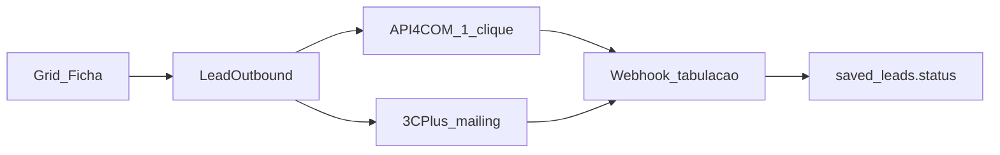

# Kit parceiro — Grid

Uma página para enviar à **API4COM** e à **3C Plus** junto com o pedido de aval. Anexe três prints: Conexões, ficha com Ligar, Grid com Enviar.

## O que o Grid é

O Grid gera e qualifica a lista de cold call (CNPJ, telefone E.164, score, ficha). O parceiro **executa** a ligação. Não há sync bidirecional de CRM. Não enviamos CPF. Não enviamos telefone só-OSM.

## Dois destinos

| Parceiro | Papel no Grid | O que o Piloto cola |
|---|---|---|
| API4COM | VoIP — 1 clique = 1 ligação | Token + ramal do webphone |
| 3C Plus | Discador — envia a lista ranqueada para a campanha | Domínio + token de gestor + campanha; ramal/token de agente para Ligar |

Credencial **por usuário (Piloto)**, cifrada no Grid (`INTEGRATION_KMS_KEY`). Nunca uma API key global no `.env` de produto.

## Fluxo API4COM

1. Piloto cola token + ramal em `/conexoes`.
2. Grid valida `GET /users/me` e registra o webhook se a URL for HTTPS pública.
3. Ligar na ficha → `POST https://api.api4com.com/api/v1/dialer` com `metadata.gateway = grid-podium`.
4. Hangup/answer → `POST {origin}/api/webhooks/voip/api4com/{connectionId}`.

## Fluxo 3C Plus

1. Piloto cola domínio (`empresa.3c.plus`), token de gestor e escolhe a campanha.
2. Enviar no Grid → nova lista na campanha (identifier = CNPJ, telefone BR sem +55, extras sem CPF).
3. Ligar na ficha → `POST /agent/manual_call/dial` com token de **agente** (o gestor não discar em nome do agente). O agente precisa estar logado na campanha.
4. Tabulação → `POST {origin}/api/webhooks/dialer/3cplus/{connectionId}` (HTTP). O Grid **não** abre Socket.io.

## Prints para anexar

1. **Conexões** — `/conexoes` com o card da ferramenta e o campo de token (sem o segredo visível).
2. **Ficha** — botão Ligar na empresa (API4COM) ou o mesmo botão com discador ativo.
3. **Grid** — Enviar para a conexão 3C Plus / webhook, ao lado de Exportar.

URL pública de inbound (não localhost). Ex.: `https://grid.mundopodium.com.br/api/webhooks/voip/api4com/{id}`.

## Compromissos

- Credencial por Piloto, cifrada; o Grid não guarda uma chave global do parceiro.
- Payload canônico: CNPJ, razão, E.164, score, ficha. **Sem CPF.**
- `push_list` cobra o crédito de exportação; ligar e tabulação são grátis.
- Logo no catálogo `/conexoes` só com aval escrito de marca.
