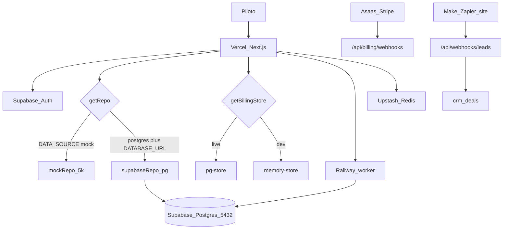

# GRID — Relatório de estado para o Cloud

**Data:** 05/09/2026  
**Produto:** GRID · Mundo Pódium  
**Repo:** `grid-podium` (privado)  
**App em produção:** https://grid-podium.vercel.app  
**Domínio custom:** `grid.mundopodium.com.br` — **ainda não apontado** neste projeto Vercel

Este arquivo é o **handoff atual**. Substitui o briefing de 13/08/2026 como fonte de verdade do *que está no código*. Os docs antigos continuam válidos só como **intenção de produto**, não como status.

---

## 0. Como usar este arquivo no Cloud

Cole este documento (ou abra o repo e leia `docs/status-cloud.md`) e peça:

> Avalie a estrutura inteira do GRID a partir deste relatório e do código atual. Atualize o plano: o que já está entregue, o que está WIP nesta árvore, o que falta para um piloto com ~10 usuários, e o que priorizar agora. Não reimplemente Fases 0–3. Não reabra Largada/Grid/Ficha. Não instale shadcn. Não volte o fundo para preto. Não trate Automações como motor de workflow genérico. Não use `briefing_claude_proximo_passo.md` como status — ele está defasado.

Anexos no repo (ler, não recopiar):

| Arquivo | Papel |
|---|---|
| `docs/status-cloud.md` | **Este arquivo** — estado atual |
| `README.md` | Como subir, scripts, regras |
| `docs/deploy-vercel-railway.md` | Topologia Vercel + Supabase + Railway |
| `docs/integracoes.md` | Contrato outbound (push / call / tabulação) |
| `plano_app_prospeccao_mundo_podium.md` | Intenção original (12/08/2026) |
| `prompt_cursor_grid.md` | Prompt mestre Fases 0–1 (histórico) |
| `briefing_claude_proximo_passo.md` | Handoff 13/08/2026 — **defasado** |

---

## 1. O produto, em uma frase

SaaS brasileiro de **criação de lista, qualificação de leads e CRM** para cold call. O usuário é o **Piloto** (aluno do Mundo Pódium).

Fluxo na UI: **Box → Largada → Grid → Ficha → CRM**.

Promessa atual (`src/lib/copy.ts`):

> Monte a lista, encontre quem decide e ligue — com CRM incluído.

Não é extrator de Google Maps. Fonte da lista: **Dados Abertos do CNPJ** (Receita Federal). A lista sai ranqueada com telefone da empresa, decisor (sócio/QSA) e selo de confiança do número. Qualificação digital (site, selos CONFIRMADO/ATUALIZADO, Minuto de Ouro) entra depois, via worker. CRM nativo, importação de planilha e automações inbound (webhook → deal) já existem no código.

---

## 2. Regras inegociáveis (não relaxar)

1. **Nunca** Google Places / Maps API. Link `maps/search` no dossiê **é permitido**.
2. Campo vazio na UI → `NÃO ENCONTRADO` ou `NÃO VERIFICADO`. Silêncio é bug.
3. **Nunca** CPF em banco, UI, export ou payload de integração.
4. Interface em **pt-BR**. Código, variáveis e comentários em **inglês**.
5. Todo campo enriquecido carrega proveniência `{ valor, fonte, coletado_em }`.
6. **Nunca** CNAE literal no código-fonte. Tudo vem de `ref_cnae` + keywords do preset.
7. OSM **só sinal booleano**. Número do OSM **nunca** vai para export.
8. Crawler respeita `robots.txt`, User-Agent identificado (`GridBot/1.0`), rate limit por domínio.
9. **Buscar e ver é grátis.** Crédito queima em **qualificar** (1) e **exportar** (50 por empresa já qualificada). Ligar da ficha é grátis.
10. Produção: sem `GRID_MOCK_AUTH`, sem `DATA_SOURCE=mock`, sem `BILLING_STORE=memory`, sem `MOCK_PREVIEW_SEALS`. Guard: `assertProdEnv()` em `src/lib/env/deploy.ts`, chamado em `instrumentation.ts`.
11. Dados da Receita e enriquecimento **só** pelas APIs autenticadas do Next.js — nunca PostgREST / anon key no browser.
12. GitHub **privado**. Nunca commitar `.env`. Antes de push: `pnpm launch:secrets`.

Design vigente (não o prompt original):

```
--podium-navy:    #0B1A2E   /* fundo — oficial */
--podium-panel:   #12263F
--podium-panel-2: #183250
--podium-yellow:  #F5B301   /* único accent */
--podium-white:   #FFFFFF
--podium-gray:    #C5CDD8
--podium-muted:   #7A8494
--podium-success: #22C55E   /* só prova confirmada */
```

Amarelo **nunca** decorativo. Sem shadcn/ui. Componentes próprios (`GlassCard`, `SectionTitle`, `Hint`, `ContactSeal`, `AppShell`…). Fonte **Sora**. Tema escuro sempre. Logos em `/public/brand/` (`lockup.png` oficial na maioria das telas).

---

## 3. Aviso: docs antigos estão defasados

O briefing de 13/08/2026 dizia: Fase 1 entregue, Fase 2 é o próximo passo, Fases 3–4 (créditos, CRM, API) fora. **Isso não é mais verdade.**

| O briefing de agosto dizia | Realidade em 05/09/2026 |
|---|---|
| Fase 2 (worker, selos reais) = próximo passo | **No código.** Fila `enrichment_jobs`, worker Railway, `deriveSeal`, auditoria, Minuto de Ouro |
| Créditos/pagamento = Fase 3, UI cosmética | **No código.** Catálogo, Asaas/Stripe/Circle, webhooks, tanque de créditos |
| CRM / API = Fase 4, fora | **No código.** Kanban nativo, import, inbound webhooks, ops console |
| Auth só mock | **Supabase Auth** (e-mail/senha + Google). Mock só se `GRID_MOCK_AUTH=1` ou keys ausentes |
| PDF stub | **PDF branded** via `@react-pdf/renderer` |
| Crédito 1 = export, 2 = enrich | **1 = qualificar, 50 = exportar** empresa já qualificada |
| Fundo / stack do prompt original | Navy, sem shadcn, sem Prisma, SQL via `pg` |

Use o plano original e o prompt mestre para **intenção**. Use este arquivo + o código para **estado**.

---

## 4. Status por domínio

Legenda: **live** = caminho de produto utilizável (mock ou Postgres). **paywall** = existe, gated por `enrichAllowed`. **standby** = código existe, flag desliga a UI. **WIP** = nesta árvore, pode não estar committed/estável. **stub** = catálogo/UI “em breve”.

| Domínio | Status | Notas |
|---|---|---|
| Ingestão RF (`scripts/ingest`) | live (código) | Carga real depende de `DATABASE_URL` + zips. Validação de volume MG/SP+ **não comprovada** neste handoff |
| Largada / Grid / Ficha / Listas | live | Fluxo principal. Mock 5k empresas / 27 UFs |
| Selos de telefone | live | `deriveSeal`: CONFIRMADO / ATUALIZADO / Contabilidade / Grupo / Não confirmado. Sorteio só com `MOCK_PREVIEW_SEALS=1` **e** mock |
| Worker de enriquecimento | live | `worker/` + `pnpm worker:dev` / `worker:once`. Serper opcional para descobrir domínio |
| Export CSV / XLSX / PDF | live | Só leads **qualificados**. Débito 50 créditos/CNPJ. Quote em `/api/export/[searchId]/quote` |
| Auth | live | Supabase SSR. Middleware protege rotas logadas. `/admin` via `GRID_ADMIN_EMAILS` |
| Billing / planos / checkout | live | Asaas + Stripe; Circle = tesouraria. Store `pg` ou `memory` |
| CRM nativo | paywall | Pipelines, stages, deals, events, briefing, dial. `enrichAllowed` |
| Importações (CSV/XLSX) | paywall / **WIP** | Parse → map → match CNPJ → apply → histórico. Ver §8 |
| Automações inbound | paywall / **WIP** | Campanha webhook → deal. **Não** é motor “se stage muda, então…” |
| Conexões (VoIP / CRM externo) | **standby** | `CONNECTIONS_STANDBY = true` em `src/lib/integrations/standby.ts`. Adapters live: webhook, api4com, zenvia, twilio, telnyx. Push nativo de CRM externo = catálogo |
| Painel | live | Métricas de buscas, ligações, CRM |
| Calculadora + Metas | live | `/calculadora`, `/metas` |
| Ops console | live | Login próprio (`GRID_OPS_PASSWORD`), fora do middleware de sessão |
| Admin nichos | live | `/admin/nichos`, e-mail em `GRID_ADMIN_EMAILS` |
| Cron mensal RF | stub | Pipeline de ingestão existe; agendamento mensal de produção **não** é o foco atual |
| Seats Escuderia | stub | Copy: “um usuário nesta versão” |

---

## 5. Arquitetura



### Dados

- **Sem Prisma.** SQL via `pg` contra Postgres (Docker local ou Supabase).
- Switch: `src/lib/data/index.ts` — `DATA_SOURCE=postgres|supabase|live` **e** `DATABASE_URL` → `supabaseRepo`. Sem URL em modo live → **throw** (não cai no mock em silêncio). Default local sem env = mock.
- Interface: `src/lib/data/repo.ts` (`GridRepo`).
- CRM mixins: `src/lib/data/crm-pg.ts` / `crm-mock.ts`.
- Billing é store **separado**: `getBillingStore()` → pg ou memory.
- Browser **nunca** usa PostgREST para dados RF. Migration `20260903000000_lock_postgrest.sql` existe.

### Auth

- `src/middleware.ts` + `@supabase/ssr`.
- Mock quando `GRID_MOCK_AUTH=1` ou keys ausentes → usuário fixo `LOCAL_USER_ID`.
- Prefixo protegido inclui: painel, box, calculadora, metas, largada, empresas, grid, lead, listas, crm, conta, setup, pagar, conexoes, importacoes, automacoes, admin.
- `/ops` tem cookie próprio, fora desse matcher.

### Deploy

```
Usuário → Vercel (Next.js)
            ↓ DATABASE_URL :5432 direct
         Supabase Postgres + Auth
Railway → pnpm worker:dev
Billing webhooks → /api/billing/webhooks/*
Cache / rate-limit → Upstash Redis
```

Detalhe operacional: `docs/deploy-vercel-railway.md`. Configs: `vercel.json`, `railway.toml`, `Procfile`, `nixpacks.toml`, `docker-compose.yml` (Postgres local opcional).

---

## 6. Stack real

| Camada | Escolha |
|---|---|
| Runtime | Node ≥ 20, pnpm |
| App | Next.js **15.5** App Router, React **19**, TypeScript 5 |
| CSS | Tailwind **v4** |
| Motion / ícones | Framer Motion, lucide-react |
| Forms | react-hook-form, Zod 4 |
| Dados | `pg` (não PostgREST) |
| Auth | `@supabase/ssr`, `@supabase/supabase-js` |
| Query | `@tanstack/react-query` |
| DnD CRM | `@dnd-kit/*` |
| Export | exceljs, `@react-pdf/renderer` |
| Crawl | cheerio, undici; yauzl nos zips de ingestão |
| Testes | Vitest 3, colocalizados `*.test.ts` (~173 arquivos). **Sem Playwright** |
| **Não usado** | Prisma, shadcn/ui, Clerk, i18n lib |

Copy centralizada: `src/lib/copy.ts` (pt-BR only).

---

## 7. Mapa do repo

### Páginas

| Rota | Função |
|---|---|
| `/` | Landing |
| `/entrar` | Login |
| `/box` | Home logada / CTA Nova largada |
| `/painel` | Dashboard |
| `/largada` | Filtros da busca |
| `/grid/[searchId]` | Tabela ranqueada |
| `/lead/[cnpj]` | Ficha / dossiê / Minuto de Ouro |
| `/listas` | Listas salvas |
| `/empresas` | Busca por empresa/CNPJ |
| `/crm` | Kanban |
| `/importacoes` | Planilha → CRM |
| `/automacoes` | Campanhas inbound |
| `/conexoes` | Integrações (standby VoIP) |
| `/conta` `/setup` | Perfil / onboarding |
| `/calculadora` `/metas` | Funil e metas |
| `/planos` `/pagar` `/pagar/sucesso` `/pagar/pendente` | Billing |
| `/admin/nichos` | Curadoria |
| `/ops` `/ops/entrar` `/ops/usuarios/[id]` | Console interno |
| `/bot` `/privacidade` `/termos` `/opt-out` `/duvidas` | Legais / bot / FAQ |

### APIs (grupos)

- **Auth / meta:** `/api/auth`, `/auth/callback`, `/api/session/catch-up`, `/api/meta`, `/api/opt-out`
- **Busca / grid / lead / enrich / export:** `/api/search/*`, `/api/grid/*`, `/api/lead/*`, `/api/enrich`, `/api/export/*`, `/api/empresas/*`
- **Nichos / ref:** `/api/niches/*`, `/api/ref/cnaes`, `/api/ref/municipios`
- **Perfil / painel / metas:** `/api/profile/*`, `/api/painel/metrics`, `/api/calculadora`, `/api/metas/*`
- **Billing:** `/api/billing/me`, `checkout`, `cancel`, `order/[id]`, webhooks asaas/stripe/circle
- **CRM:** pipelines, stages, deals (move/call/complete/schedule/outcome/briefing/events), `deals/search`, `deals/cnpjs`
- **Import:** `/api/crm/import`, `import/parse`, `import/[runId]`
- **Inbound:** `/api/crm/inbound`, `inbound/[endpointId]`, `inbound/[endpointId]/events`
- **Webhooks públicos de lead:** `/api/webhooks/leads`, `/api/webhooks/leads/[endpointId]`
- **Integrações:** connections, call, push, jobs, `/api/webhooks/inbound/[connectionId]`, `/api/webhooks/voip/*`
- **Ops:** login/logout, metrics, users, credits, trial, cancel

### Libs âncora

| Path | Papel |
|---|---|
| `src/lib/copy.ts` | Glossário UI |
| `src/lib/types.ts` | Filtros, dossiê, selos |
| `src/lib/scoring.ts` | GRID_WEIGHTS + dor digital |
| `src/lib/contact-confidence.ts` | Selos |
| `src/lib/data/index.ts` `repo.ts` | Dual-mode dados |
| `src/lib/billing/catalog.ts` `service.ts` | Planos e débitos |
| `src/lib/crm/*` | Board, import, inbound |
| `src/lib/enrichment/*` | Crawl, domínio, OSM, presença |
| `src/lib/integrations/*` | Adapters outbound |
| `src/lib/env/deploy.ts` | Guard de produção |
| `src/middleware.ts` | Gate de sessão |

### SQL

- `supabase/migrations/` — 36 arquivos, de `20260812` (schema) até `20260917` (inbound events). **Fonte de verdade** para app DB.
- `scripts/ingest/schema-rf.sql` — empresas, establishments, sócios, `ref_cnae`, views de telefone compartilhado.
- `scripts/ingest/schema-app.sql` — snapshot de bootstrap. **Mais magro** que as migrations (faltam colunas de deal como `cnpj` / `people` / `meta` / `outcome` em relação ao conjunto migrado). Preferir `pnpm db:apply-app` + migrations.
- `scripts/db/apply-app.ts` — aplica migrations de app (inclui inbound + import).

### Worker e scripts

- `worker/index.ts`, `worker/once.ts`
- `pnpm ingest`, `seed:presets`, `db:verify-rf`, `db:dump-supabase`, `launch:check|ready|secrets|smoke|webhooks`

---

## 8. WIP nesta árvore (set/2026)

Trabalho recente (working tree / arquivos novos) completa **import + inbound**, não o kanban (esse já estava maduro).

### Importação

```
CSV/XLSX (máx. 2 MB, 500 linhas)
  → POST /api/crm/import/parse
  → mapeamento de colunas
  → POST /api/crm/import
       → match CNPJ só se hit único de nome
       → applyImportLeads (dedupe CNPJ/telefone/nome, source: import)
       → qualify opcional (créditos + fila)
       → createCrmImportRun (histórico)
  → GET /api/crm/import e /[runId]
```

Arquivos: `src/lib/crm/import.ts`, `import-apply.ts`, `import-match.ts`, `import-history.ts`, `import-file.ts`, `import-xlsx.ts`, `src/components/importacoes/ImportacoesPanel.tsx`, `ImportHistory.tsx`.

### Automações inbound

Não é Zapier interno. É **campanha**: endpoint + Bearer token (hash SHA-256 no banco; token em claro só no create/rotate) → POST público → `handle-inbound-lead.ts` → deal `source: inbound` + log de eventos.

- Limite: `AUTOMATION_LIMIT = 10`
- Canais: `site` \| `ads`; tipo `company` \| `person`
- UI: `src/components/automacoes/AutomacoesPanel.tsx` — criar, copiar URL/token, rotacionar, apagar, feed de eventos, ajuda Make/site
- PATCH de destino (`pipeline_id`/`stage_id`) existe na API; a UI **não** edita destino depois de criar

### Soft spots deste WIP (sem TODO no código)

1. Match CNPJ ambíguo **pula em silêncio** (só hit único).
2. Falha ao persistir o run de import é logada; a resposta de import ainda pode suceder sem linha de histórico.
3. `schema-app.sql` atrasa as colunas de deal das migrations.
4. Token show-once: perdeu → rotaciona.

---

## 9. Billing vigente (não o do briefing)

Constante: `ENRICH_CREDIT_COST = 1`, `EXPORT_CREDIT_COST = 50` em `src/lib/billing/catalog.ts`.

| SKU | Nome | Preço | Créditos | CRM / enrich |
|---|---|---|---|---|
| `free` | Treino livre | 0 | 25 qualify/mês | **não** (`enrichAllowed: false`) |
| `piloto` | Piloto | R$ 97 | 900/mês | sim |
| `piloto_pro` | Piloto Pro | R$ 197 | 4.000/mês | sim |
| `escuderia` | Escuderia | R$ 397 | 6.000/mês | sim; 1 usuário nesta versão |
| `membro_plataforma` | Membro da Plataforma | 0 (cupom) | 900 / 30 dias | sim |
| packs | 100 / 500 / 2000 | avulso | créditos extras | — |

Regras:

- Buscar e ver a lista: grátis.
- Qualificar (ficha + worker): 1 crédito.
- Exportar (CSV/XLSX/PDF **ou** `push_list` webhook): 50 por CNPJ já qualificado. CNPJ já cobrado não paga de novo.
- Ligar (`tel:` / originate) e tabulação inbound: grátis.
- Treino livre esgota as 25 qualifies e **não** abre CRM/export.

PSPs: Asaas (Pix/cartão BR/boleto), Stripe (cartão intl), mock em dev. Circle = sweep de tesouraria, não checkout do Piloto.

---

## 10. Gaps reais agora (para o plano novo)

Não reabrir a lista do briefing §10 (auth mock, PDF stub, créditos cosméticos) — a maior parte já foi feita.

1. **DNS** — `grid.mundopodium.com.br` ainda não está no projeto Vercel. Site URL / OAuth / webhooks no deploy doc assumem esse host.
2. **Conexões VoIP** — `CONNECTIONS_STANDBY = true`. Copy: “ligação pela internet volta na próxima versão”; botão Ligar abre o telefone do aparelho.
3. **CRM externo nativo** — catálogo (Agendor, Pipedrive, HubSpot…) em grande parte “soon”. Push de lista **live** nesta versão: webhook genérico.
4. **Validação RF em volume** — limiar de telefone compartilhado (3 CNPJs) precisa revalidação em MG/SP reais (`reports/phone-sharing.md`). Aceite original (Lighthouse 90, busca &lt; 2s na base RF) **não medido** em produção.
5. **Exclusões de nicho** — `exclusoes[]` nos seeds, pouco preenchido (posto vs clínica, etc.).
6. **schema-app.sql vs migrations** — risco se alguém bootstrapar só o snapshot.
7. **Sem e2e Playwright.** Vitest cobre domínio/API; UI de import/automações não tem teste de componente de página.
8. **Cron mensal da RF** e seats multi-usuário da Escuderia — explicitamente próxima etapa.
9. **WIP import/inbound** — conferir se migrations `crm_import_runs` + `crm_inbound_events` estão aplicadas em **todos** os ambientes (local, Supabase prod).
10. Integrações: adapter não registrado **lança** `adapter not implemented` (`src/lib/integrations/adapter-registry.ts`).

---

## 11. O que o Cloud **não** deve fazer

- Reimplementar ingestão, Largada, Grid, Ficha, selos, worker, billing, kanban CRM.
- Instalar shadcn/ui, Prisma, i18n, Clerk.
- Voltar o fundo para `#0D0D0F` / “prompt original como spec de UI”.
- Expor PostgREST / anon key para dados RF.
- Tratar `/automacoes` como motor de regras (e-mail no stage change, etc.). Hoje é só **webhook → deal**.
- Reabrir o hub VoIP sem decisão explícita de desligar `CONNECTIONS_STANDBY`.
- Inventar CNAEs, CPFs, números OSM no export, ou LLM no Minuto de Ouro.
- Usar o modelo de créditos 1/2 do briefing de agosto.

---

## 12. Arquivos para ler primeiro (ordem sugerida)

1. Este arquivo.
2. `src/lib/copy.ts` — o produto na boca do Piloto.
3. `src/lib/data/index.ts` + `src/lib/data/repo.ts` — fronteira mock/live.
4. `src/lib/billing/catalog.ts` + `src/lib/billing/service.ts` — dinheiro.
5. `src/middleware.ts` + `src/lib/env/deploy.ts` — auth e prod guard.
6. `src/lib/crm/types.ts` + `schema.ts` + `cadence.ts` — CRM.
7. `src/lib/crm/import-apply.ts` + `handle-inbound-lead.ts` — WIP atual.
8. `docs/deploy-vercel-railway.md` + `docs/integracoes.md`.
9. `supabase/migrations/` (nomes dos arquivos, depois o SQL que o plano tocar).

Não começar pelo `prompt_cursor_grid.md`. Ele descreve um app que **não** é o que está no disco.

---

## 13. Perguntas que o plano atualizado deve responder

O Cloud deve devolver um plano (não um rewrite do produto) que responda:

1. **Piloto com ~10 usuários:** o que falta de verdade (DNS, secrets, RF carregada, worker Railway, webhooks Asaas/Stripe, migrations de import/inbound aplicadas) vs. polish de produto?
2. **Prioridade agora:** ops/DNS vs. fechar o WIP de import/automações vs. reabrir VoIP vs. cron RF vs. exclusões de nicho?
3. **Working tree vs. committed:** o que deste relatório está só local (import history, inbound events, página de automações) e precisa entrar num commit/PR antes de o Cloud “assumir” que está em produção?
4. **Estrutura:** há dívida que atrapalha o próximo passo (schema-app vs migrations, `GridRepo` inchado, dual mock/pg, Conexões congeladas no meio do Box)?
5. **Fora de escopo consciente:** seats Escuderia, CRM externo nativo, workflow automation genérico — confirmar que continuam fora até o piloto.

Critério de sucesso do plano novo: um agente seguinte consegue executar **uma** fatia sem reabrir o GRID seco e sem contradizer créditos, navy, ou as regras inegociáveis.

---

## 14. Como o app sobe hoje

Mock (sem banco):

```bash
pnpm install
pnpm dev
```

http://localhost:3000 → Entrar (mock) → Box → Nova largada.

Live: `.env.local` com `DATA_SOURCE=postgres`, `DATABASE_URL` **direct 5432**, keys Supabase. Ver README seção “Ligar o Supabase”. Worker: `pnpm worker:dev`. Produção: `pnpm launch:check` / `launch:ready`.
